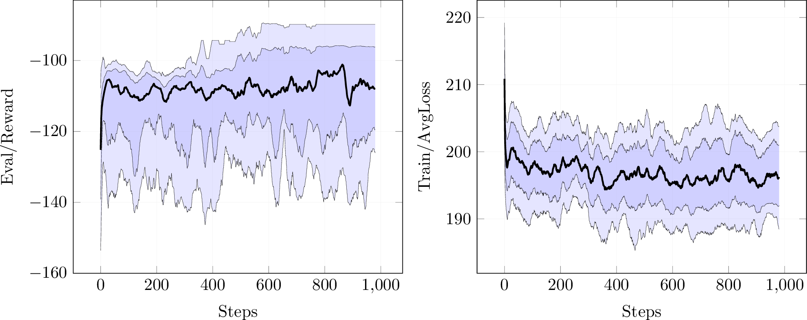

This is a bootleg version of AlphaZero written in C++. It also includes some work leading up to it such as MCTS, imitation learning and a Python implementation (which I stopped working with due to performance). I tried a kind of bridge whereas the C++ code is the main program which only calls gym routines in Python using the Python C API, but unfortunately that turned out to be too slow. Thus, I went for a pure C++ version and included a few environments from [openai/gym](https://github.com/openai/gym/) rewritten in C++ (see the envs folder).

Below is the result of training 10 times on MountainCar using bootleg AlphaZero with parameter configuration 127. More current configurations can be seen [here](https://github.com/instance01/BootlegAlphaZero/blob/master/alphazero/cpp_impl/results.md).
 

Quite the variance, and takes ages to learn (roughly 6 hours to be more precise). Needs more work.

## Setup with Docker

These are instructions for the C++ version.

1. Go to `alphazero/contrib` and build the Docker image: `sudo docker build -t grab0 -f Dockerfile .`.
2. Go to `alphazero/cpp_impl` and run the Docker image: `sudo docker run -v $(pwd):/app --privileged -it grab0 bash`.
3. In the Docker image execute `setup` to compile.
4. BootlegAlphaZero can be run as `./GRAB0 <game> <parameters>`, e.g. `./GRAB0 mtcar 133`. All parameters are listed in `simulations.json`.

## Setup without Docker

This is for Debian Buster. This could be automated at some point.

1. Go to `alphazero/contrib`.
2. Run `printf "deb http://httpredir.debian.org/debian buster-backports main non-free\ndeb-src http://httpredir.debian.org/debian buster-backports main non-free" > /etc/apt/sources.list.d/backports.list`.
3. Run `apt-get update --allow-releaseinfo-change && apt-get install -t buster-backports -y g++ vim gdb cmake python3-dev wget unzip git libprotobuf-dev libprotobuf17 protobuf-compiler nlohmann-json3-dev`.
4. Run `pip3 install pytest numpy cython torch gym gym-minigrid git+https://github.com/instance01/gym-mini-envs.git`.
5. Go to `alphazero/cpp_impl`.
6. Run `cmake . && cmake --build .`.
