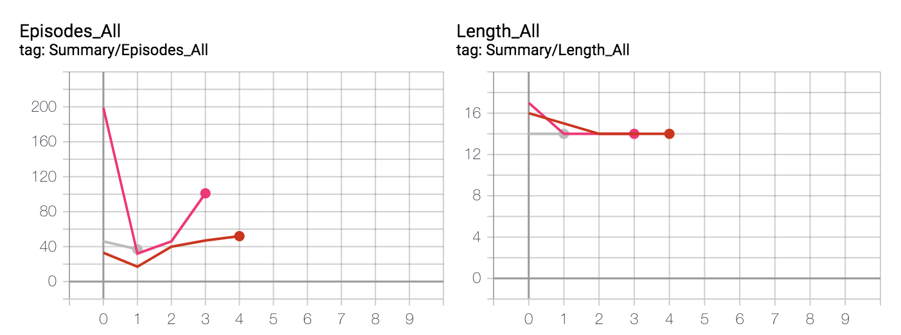
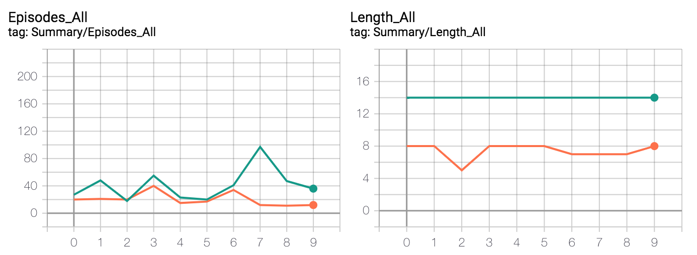

For bootleg AlphaZero, results can be seen by going into the directory `alphazero` and executing `tensorboard --logdir runs/`.
Usually there are 10 runs, e.g. `Eval/Reward/0` up to `Eval/Reward/9`.
For now, `simulate.py` contains all simulations and the results incl. the corresponding tensorboard events directory.
It also contains examples on how to monkey patch gym environments to work with the framework, specifically right now [MiniDiscreteEnv](https://github.com/instance01/gym-mini-envs) and GridWorld.

Below you can see an excerpt of the tensorboard charts (x axis is number of run; usually there are 10). We see that a solution on an empty 8x8 grid world (right chart, green line) is always found, but it is slightly suboptimal (optimal length of path is 11).

  
   

Below is the result of training 10 times on MountainCar using the C++ version of AlphaZero with parameter configuration 127. More current configurations can be seen [here](https://github.com/instance01/GRAB0/blob/master/alphazero/cpp_impl/results.md).
 

Quite the variance, and takes ages to learn (roughly 6 hours to be more precise). Needs more work.
