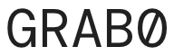

For bootleg AlphaZero, results can be seen by going into the directory `alphazero` and executing `tensorboard --logdir runs/`.
Usually there are 10 runs, e.g. `Eval/Reward/0` up to `Eval/Reward/9`.
For now, `simulate.py` contains all simulations and the results incl. the corresponding tensorboard events directory.
It also contains examples on how to monkey patch gym environments to work with the framework, specifically right now MiniDiscreteEnv and GridWorld.
